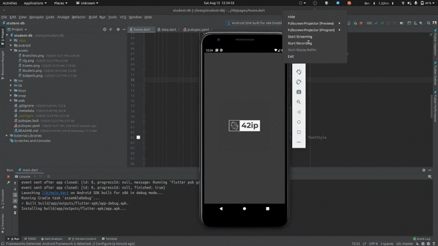

# Student-db

#### Front end of the Student Database is made using Flutter which supports full CRUD operations

This is basically a student academic information registration application which allows the student to track their data easily. (**It ensures data probity**)

This Project allows Students to see their details by entering their credentials

## Preview



### To download on android download the [apk](https://github.com/42ip/student-db/releases/download/v1.0.0/app-release.apk)

### To download on linux distributions [snap](https://github.com/42ip/student-db/releases/download/v1.0.0/student-db.snap)
#### run the command 
``` snap install --dangerous student-db.snap --devmode ```
